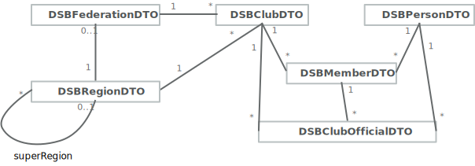

# DSB Mitglieder API

## Datenmodel

 

 Das Diagramm liegt ebenfalls als PDF Datei _DSBMitgliederAPI-UML.pdf_ bei.

## Regionale Autorisierung und zweistufige Datentiefe

Das API versendet die Datenobjekte in zwei unterschiedlichen Umfängen bzw Datentiefen:

- **public**: eine Form, die für die Verarbeitung personenbezogener oder anderweitiger Informationen **für alle beteiligten Systeme relevant** ist bzw relevant sein kann; so wird zB die Vereinsnummer und der Name aller deutschen Vereine als für alle Systeme relevant angesehen.

- **protected**: eine Form mit erhöhtem Schutzniveau. So sind zB die Kontaktdaten eines Spielers oder einer Spielerin protected, sein bzw ihr Name, Geburtsjahr und die Nationalität jedoch public.

Für _Vereine_ und _Personen_ gibt es jeweils zwei Schemas, ein public und ein darauf aufbauendes protected Schema. Die protected Schemata enden mit dem Zeichen "\_" gefolgt von der extension ".schema.json". _DSBPersonDTO.schema.json_ ist also das Schema des DTOs, das allen endpoints zugesendet wird, _DSBPersonDTO\_.schema.json_ das Schema der Objekte, die nur an die regional autorisierten endpoints zugesendet werden. Im zweiten Fall wird auf das Zustellen des public DTOs verzichtet, da dieser Teil des protected DTOs ist.

Adressen, Vereinsfunktionen und Spielgenehmigungen werden ausschließlich als protected DTOs an die regional autorisierten endpoints gesendet. Für dieses DTOs gibt es daher nur das protected Schema.

Regionen, Verbände und Vereinsmitgliedschaften werden nur als public DTO versendet.  Für dieses DTOs gibt es daher nur das public Schema.

Die regionale Autorisierung erfolgt durch eine hierarichische Regionen-Codierung. Diese beginnt mit "DE." und folgt der regionalen Struktur des DSB über Regionalligen, Landesverbände, Bezirke bis zu Kreisen. Je höher ein Endpoint mit seiner Region angesiedelt ist, desto mehr DTOs bekommt er als protected DTO. Die einzelnen protected Datenobjekte werden mit ein oder mehreren Regionen (auf tiefster Ebene) gekennzeichnet und werden dann auf die passenden endpoints gesendet:

Ist also zB ein Spieler Mitglied in zwei Vereinen in zwei unterschiedlichen Landesverbänden, dann wird sein protected DTO mit den zwei jeweiligen Kreis-Regionen gekennzeichnet und an beide Landesverbände und den DSB gesendet.

## REST Endpoints

- PUT …/regions/{reg-uuid}, body: DSBRegionDTO
- PUT …/federations/{fed-uuid}, body: DSBFederationDTO
- PUT …/clubs/{club-uuid}, body: DSBClubDTO bzw DSBClubDTO_
- DELETE …/clubs/{club-uuid}
- PUT …/addresses/{addr-uuid}, body: DSBAddresseDTO_
- DELETE …/addresses/{addr-uuid}
- PUT …/persons/{pers-uuid}, body: DSBPersonDTO bzw DSBPersonDTO_
- DELETE …/persons/{pers-uuid}
- PUT …/club-members/{clubmem-uuid}, body: DSBClubMemberDTO
- DELETE …/club-members/{clubmem-uuid}
- PUT …/club-officials/{official-uuid}, body: DSBClubOfficialDTO_
- DELETE …/club-officials/{official-uuid}
- PUT …/player-licences/{licence-uuid} body: DSBPlayerLicenceDTO_
- DELETE …/player-licences/{licence-uuid}